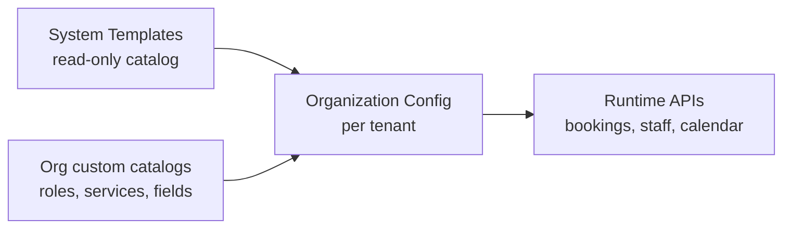
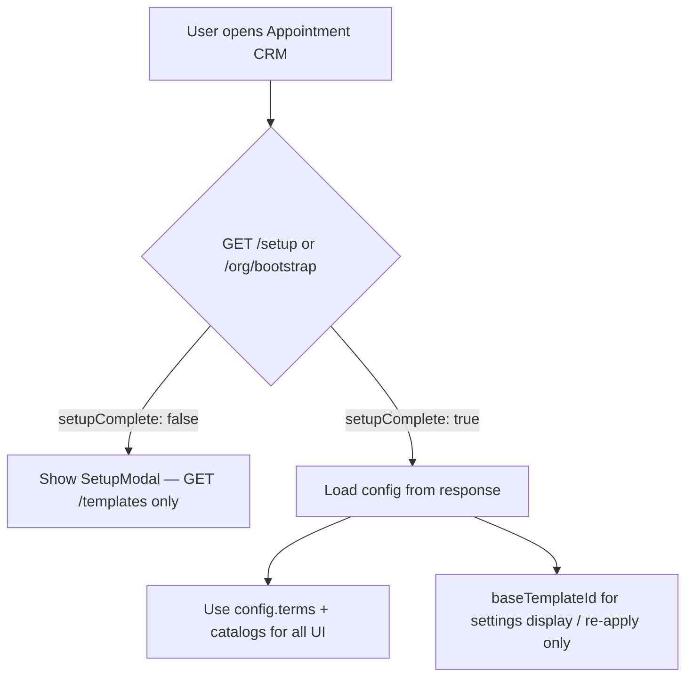
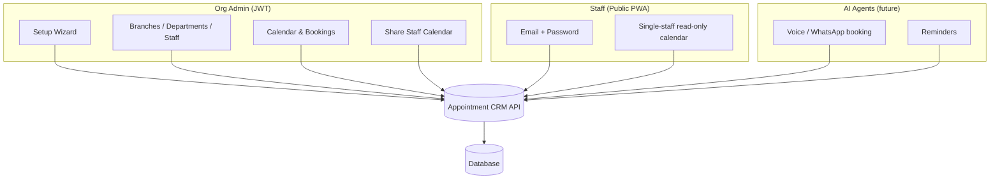
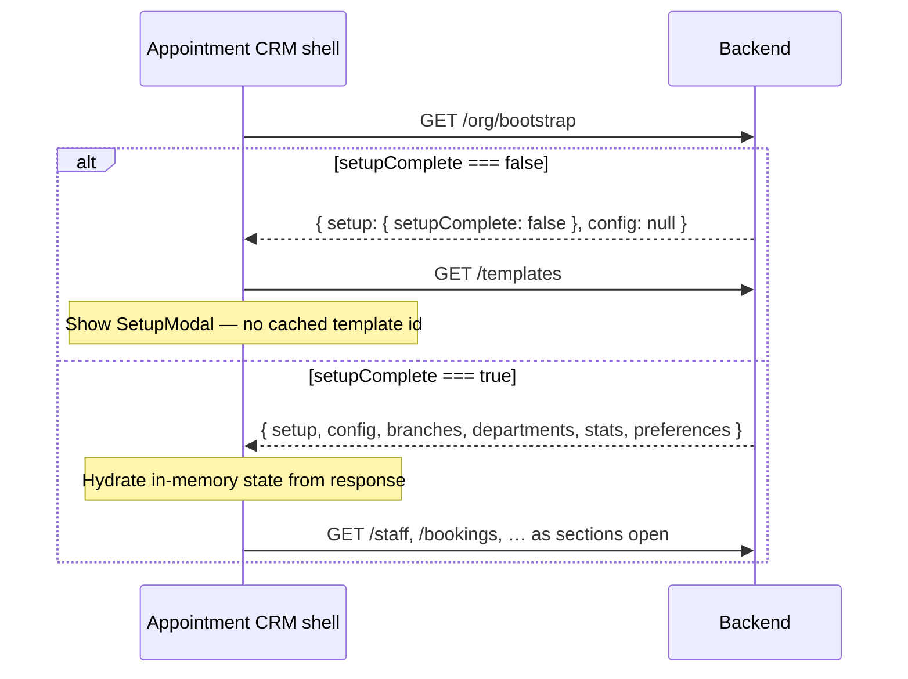
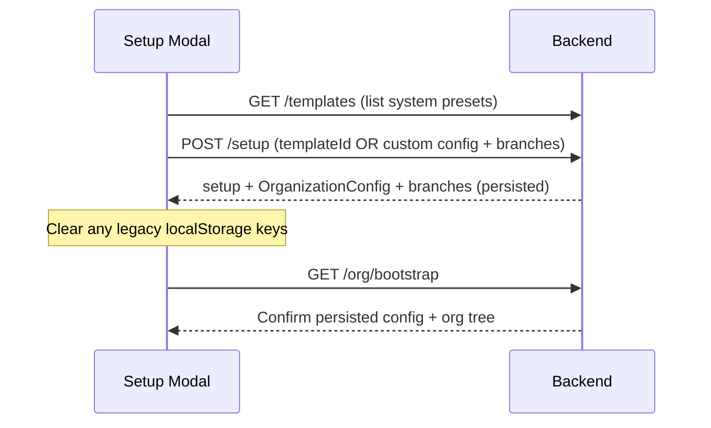
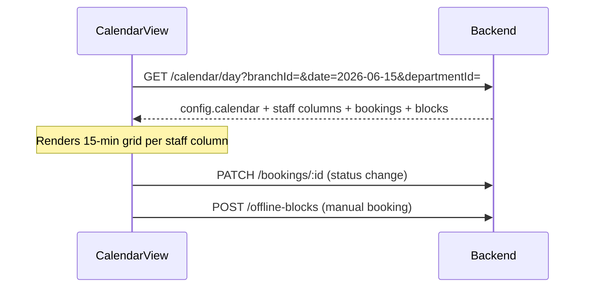
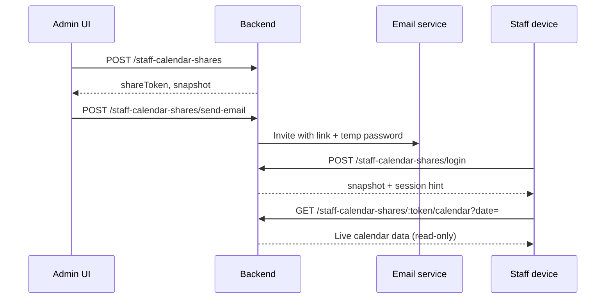

# Appointment CRM — Backend API Specification

**Audience:** Backend developers  
**Frontend module:** `src/ClientDashboard/apps/AppointmentCRM/`  
**App workspace route:** `/app/appointment-crm?section={overview|calendar|bookings|branches|staff|customers|agents|reminders|settings}`  
**Version:** 2.2 — June 2026  
**Design principle:** **Fully dynamic & template-agnostic** — API field names, endpoints, and core models use **neutral vocabulary only** (`staff`, `customer`, `branch`, `customFields`). Industry-specific labels exist only inside `OrganizationConfig.terms` and catalogs, never as hardcoded API columns. **The backend is the only source of truth** — no Appointment CRM data in browser `localStorage` or `sessionStorage`.

---

## 1. Executive summary

The **Appointment Scheduling CRM** is a marketplace app inside the ShivAI Client Dashboard. It is a **config-driven scheduling engine** — one API surface for any organization type.

Each organization gets a **resolved configuration** (`OrganizationConfig`) that defines:

- UI terminology (display labels only — e.g. what “customer” or “staff” is called in the UI)
- Catalogs: staff roles, services, appointment types, booking custom fields
- Calendar defaults: slot size, visible hours, default duration
- Reminder channels, branch seeds, template icon

Orgs may:

1. **Start from a system template** (`template_a`, `template_b`, `generic`, … — opaque IDs; see `GET /templates`)
2. **Fork and customize** any template (add roles, fields, services)
3. **Build fully custom** (`templateSource: "custom"`) without picking a preset

**Backend must never hardcode** industry-specific field names in core tables or response keys. Use **catalogs + `customFields` JSON** validated against the org field schema. Display wording comes from `config.terms`, not from API property names.

**Persistence rule:** All CRM state — including **which template was chosen at setup**, resolved `OrganizationConfig`, branches, staff, bookings, catalogs, and user preferences (e.g. active branch) — is **stored and read from the backend only**. The frontend must not persist CRM data in `localStorage`, `sessionStorage`, or IndexedDB. On every app open, the client calls `GET /org/bootstrap` (or `GET /setup` if incomplete) to learn `setupComplete`, `baseTemplateId`, and the full resolved config.

**Frontend migration:** Legacy stores (`*Store.ts`, `industryConfig.ts` local keys) are temporary. Target: `appointmentCrmAPI.ts` + in-memory React state / query cache only.

---

## 2. Conventions

### 2.1 Base URL

```
{VITE_API_BASE_URL}/appointment-crm
```

Example production base (align with existing ShivAI APIs):

```
https://nodejs.service.callshivai.com/api/v1/appointment-crm
```

### 2.2 Authentication

| Caller | Auth |
|--------|------|
| **Organization admin** (dashboard) | `Authorization: Bearer <jwt>` — same session as main ShivAI app |
| **Staff member** (shared calendar PWA) | No JWT. Email + password per share link (see §5.3, Module M) |

All admin endpoints are **scoped to `organizationId`** derived from the JWT (do not trust `organizationId` in request body).

### 2.3 Response envelope

Frontend accepts either shape (existing pattern in share-calendar API stubs):

```json
{ "data": { ... } }
```

or bare object. Prefer consistent envelope:

```json
{
  "success": true,
  "data": { ... },
  "message": "optional"
}
```

Errors:

```json
{
  "success": false,
  "error": {
    "code": "VALIDATION_ERROR",
    "message": "Human readable",
    "fields": { "email": "Invalid format" }
  }
}
```

### 2.4 IDs & timestamps

- Use server-generated string IDs (Mongo `ObjectId` or UUID).
- All dates: **ISO 8601** (`2026-06-15` for calendar dates, full ISO for `createdAt`).
- Times in availability/blocks: **`HH:mm`** 24-hour (`09:00`, `13:30`) OR **`h:mm AM/PM`** — frontend parses both; pick one standard (recommend `HH:mm` in API, format in UI).

### 2.5 Timezone

Organization has a canonical timezone (e.g. `Asia/Kolkata`). Store UTC in DB; return local calendar dates in org timezone for day views.

### 2.6 Pagination (list endpoints)

```
?page=1&limit=50&sort=-createdAt
```

### 2.7 Neutral API vocabulary (critical)

**Canonical resource names** — use these in paths, models, and DB columns for every org:

| Concept | API fields / paths | Never use in API |
|---------|-------------------|------------------|
| Person who books | `customer`, `customerId` | patient, client, member, student |
| Person who serves | `staff`, `staffId`, `staffLabel` | doctor, provider, stylist, teacher |
| Location | `branch`, `branchId` | campus, outlet, clinic |
| Grouping | `department`, `departmentId` | ward, zone, class |
| Scheduled slot | `booking`, `appointmentTypeId` | visit, consultation, session (as field names) |
| Extra data | `customFields.{key}` | uhid, mrn, student_id (as fixed columns) |
| Shared calendar | `/staff-calendar-shares` | `/doctor-calendar-shares` |

UI labels for the above are **only** in `OrganizationConfig.terms` (e.g. terms.customer = `"Member"`). API keys stay `customer`.

### 2.8 Template-agnostic rules

| Do | Don't |
|----|--------|
| Store `roleId` + optional `roleLabel` | Hardcode role enums in DB |
| Store `serviceId` / `specialization` as catalog ref or free text | Hardcode service names as columns |
| Validate `booking.customFields` against org field schema | Fixed per-industry columns |
| Return `config.terms` in bootstrap so UI labels are dynamic | Industry-specific keys in responses |
| Read calendar grid from `config.calendar` | Fixed 9–17, 15-min globally |

### 2.9 Server-only persistence (mandatory)

| Data | Where it lives | Never store in browser |
|------|----------------|------------------------|
| Setup + template choice | `OrganizationConfig` row (DB) | `shivai_appointmentcrm_setup_*`, `shivai_appointmentcrm_industry` |
| Resolved catalogs & terms | Same `OrganizationConfig` | `industryConfig.ts` selection |
| Branches | `branches` table | `shivai_appointmentcrm_branches` |
| Active branch preference | `user_preferences` (per user, server) | `shivai_appointmentcrm_active_branch` |
| Departments, staff, bookings, availability, blocks | Respective API tables | All `shivai_appointmentcrm_*` data keys |
| Custom catalog entries (e.g. specializations) | `/catalogs/*` | `shivai_appointmentcrm_custom_specializations` |
| Staff calendar shares | `/staff-calendar-shares` | `shivai_appointmentcrm_doctor_shares` |
| Staff PWA session | `httpOnly` cookie or `shareSessionToken` (short-lived) | `shivai_doctor_pwa_*`, sessionStorage |

**Allowed client-side only:** JWT from main ShivAI auth (existing app session), ephemeral UI state (open modal, selected date), and React Query / memory cache **refreshed from API** on load.

**Idempotency:** `POST /setup` must be **reject-if-already-complete** (409) unless an explicit admin reset exists. Template + config are written **once atomically** at setup completion.

---

## 3. Dynamic template & configuration model

### 3.1 Three layers



| Layer | Owner | Mutable by org? | Example |
|-------|--------|-----------------|--------|
| **System template** | Platform | No (versioned) | `template_healthcare_v3` preset JSON |
| **Organization config** | Tenant | Yes | Forked from `template_retail`, custom terms |
| **Operational data** | Tenant | Yes | Staff, bookings, blocks |

### 3.2 `OrganizationConfig` (resolved — return on every bootstrap)

This is the **single source of truth** for how an org’s CRM behaves.

```json
{
  "id": "cfg_org_123",
  "organizationId": "org_123",
  "templateSource": "preset",
  "baseTemplateId": "template_healthcare",
  "baseTemplateVersion": 3,
  "customized": true,
  "companyName": "Acme Services Ltd",
  "timezone": "Asia/Kolkata",
  "branchMode": "multi",
  "setupComplete": true,
  "terms": {
    "customer": "Customer",
    "customers": "Customers",
    "appointment": "Appointment",
    "appointments": "Appointments",
    "staff": "Staff Member",
    "staffPlural": "Staff",
    "branch": "Branch",
    "branches": "Branches",
    "agent": "Scheduling Agent",
    "department": "Department",
    "departments": "Departments"
  },
  "calendar": {
    "slotMinutes": 15,
    "defaultSlotDurationMin": 20,
    "dayStart": "09:00",
    "dayEnd": "17:00",
    "defaultWeeklyHours": { "from": "09:00", "to": "17:00", "days": ["mon","tue","wed","thu","fri","sat"] },
    "defaultDailyBreak": { "enabled": true, "from": "13:00", "to": "14:00" }
  },
  "reminderChannels": ["sms", "voice", "whatsapp"],
  "catalogs": {
    "staffRoles": [
      { "id": "role_1", "label": "Senior Associate", "sortOrder": 1, "source": "template" },
      { "id": "role_7", "label": "Specialist", "sortOrder": 7, "source": "custom" }
    ],
    "services": [
      { "id": "svc_1", "label": "General Service", "source": "template" },
      { "id": "svc_9", "label": "Premium Service", "source": "custom" }
    ],
    "appointmentTypes": [
      { "id": "apt_1", "label": "Standard Appointment", "defaultDurationMin": 20 }
    ],
    "bookingFields": [
      {
        "key": "reference_id",
        "label": "Reference ID",
        "type": "text",
        "required": false,
        "source": "template"
      },
      {
        "key": "membership_tier",
        "label": "Membership Tier",
        "type": "select",
        "options": ["Gold", "Silver"],
        "required": false,
        "source": "custom"
      }
    ],
    "offlineBlockFields": [
      { "key": "display_name", "label": "Name", "type": "text", "mapsTo": "display" },
      { "key": "reference_id", "label": "Reference ID", "type": "text", "mapsTo": "reference" }
    ]
  }
}
```

> **`terms` values are display-only.** The API always uses neutral keys (`customer`, `staff`, `branch`). Orgs may set `terms.customer` to any label without changing API contracts.

**`templateSource` values:**

| Value | Meaning |
|-------|---------|
| `preset` | Cloned from `baseTemplateId`; may have overrides |
| `custom` | Built from scratch (`baseTemplateId` = `generic` or null) |

### 3.3 System templates API (platform catalog)

Not per-tenant. Used by setup wizard & settings.

```json
{
  "id": "template_healthcare",
  "version": 3,
  "name": "Healthcare scheduling",
  "tagline": "Multi-branch appointments with departments",
  "icon": "building",
  "defaultConfig": { /* partial OrganizationConfig without organizationId */ }
}
```

Ship templates as **versioned JSON** in DB or config service. Template `id` and `name` are for setup UI only — **runtime APIs never branch on template id**.

**Starter templates:** Platform ships multiple presets via `GET /templates`. IDs are opaque strings; adding templates does not require API contract changes.

### 3.4 Customization flows

#### A) Setup with preset

```
GET /templates → user picks template
POST /setup { templateId: "template_healthcare", companyName, branches[], overrides?: {} }
→ Server clones template v3 → OrganizationConfig
```

#### B) Customize after setup

```
PATCH /config { terms: {...}, catalogs: { add staffRoles, bookingFields } } }
POST /catalogs/staff-roles { label: "Team Lead" }
POST /catalogs/services { label: "Express Service" }
POST /catalogs/booking-fields { key, label, type, options?, required? }
```

#### C) Fully custom org (no preset semantics)

```
POST /setup {
  templateSource: "custom",
  companyName: "Acme Scheduling Co",
  terms: { customer: "Client", branch: "Site", staff: "Associate", ... },
  catalogs: { staffRoles: [...], services: [...], appointmentTypes: [...], bookingFields: [...] },
  calendar: { slotMinutes: 30, dayStart: "08:00", dayEnd: "20:00" },
  branches: [{ name: "HQ" }]
}
```

#### D) Switch template (settings — destructive caution)

```
POST /config/apply-template { templateId: "template_retail", mergeStrategy: "merge_catalogs" | "replace_catalogs" }
```

`mergeStrategy` preserves custom catalog items where keys don’t conflict.

### 3.5 Catalog item conventions

All catalog arrays share:

```json
{
  "id": "cat_*",
  "label": "Display string",
  "active": true,
  "sortOrder": 0,
  "source": "template | custom",
  "metadata": {}
}
```

- **Staff** references `roleId` (catalog) + optional `roleLabel` denormalized for exports
- **Specialization** = entry in `catalogs.services` OR free-text if `allowFreeTextSpecialization: true` in config
- **Bookings** store `appointmentTypeId` + `customFields: { [key]: value }`
- **Customers** store `customFields` same schema subset

### 3.6 Field schema validation

On `POST /bookings` and `PATCH /bookings/:id`:

1. Load org `catalogs.bookingFields`
2. Reject unknown keys (or store in `extra` if `config.allowUnknownCustomFields`)
3. Validate `type`, `required`, `options` for selects

Same pattern for offline manual booking blocks using `offlineBlockFields` schema.

### 3.7 Template setup persistence (backend)

When the admin completes the setup wizard, the backend must **persist everything required to reload the correct template and config** on any device or session — without the client remembering anything locally.

#### Database records (minimum)

```
organizations (existing ShivAI tenant)
 └── appointment_crm_setup          ← wizard status + metadata
 └── appointment_crm_config       ← resolved OrganizationConfig (JSON or normalized tables)
 └── appointment_crm_catalog_*    ← or embedded in config document
 └── branches, departments, staff, …
```

#### `appointment_crm_setup` document (per `organizationId`)

| Field | Required | Purpose |
|-------|----------|---------|
| `organizationId` | Yes | Tenant key (from JWT) |
| `setupComplete` | Yes | `false` until wizard finishes |
| `templateSource` | Yes | `preset` \| `custom` |
| `baseTemplateId` | Yes if preset | e.g. `template_healthcare` — **this is how the system knows which template to load** |
| `baseTemplateVersion` | Yes if preset | Pinned version at setup time |
| `companyName` | Yes | Display name |
| `branchMode` | Yes | `single` \| `multi` |
| `timezone` | Yes | Org canonical TZ |
| `configId` | Yes | FK → resolved `OrganizationConfig` |
| `completedAt` | When complete | ISO timestamp |
| `completedByUserId` | When complete | Audit |

#### `appointment_crm_config` document (resolved config)

Store the **full resolved** `OrganizationConfig` from §3.2 (terms, calendar, catalogs). On `POST /setup` with `templateSource: "preset"`:

1. Load system template `GET /templates/:templateId` (internal)
2. Deep-clone `defaultConfig` → tenant config
3. Apply `overrides` from request body
4. Assign `organizationId`, `configId`, `baseTemplateId`, `baseTemplateVersion`, `templateSource`, `customized: false`
5. Persist config + setup row + branches in **one transaction**
6. Return full `OrganizationConfig` in response

For `templateSource: "custom"`, `baseTemplateId` may be `generic` or `null`; store the submitted `terms`, `catalogs`, and `calendar` as the config — no template clone.

#### How the app knows which template to use (runtime)



- **Runtime behavior** is driven by **resolved `OrganizationConfig`**, not by re-fetching the system template on every page load.
- **`baseTemplateId` + `baseTemplateVersion`** are stored so settings can show “Started from: Healthcare v3” and support `POST /config/apply-template`.
- **Never** infer template from client storage or `industryConfig.ts` defaults.

#### `POST /setup` response (required shape)

```json
{
  "success": true,
  "data": {
    "setup": {
      "setupComplete": true,
      "templateSource": "preset",
      "baseTemplateId": "template_healthcare",
      "baseTemplateVersion": 3,
      "companyName": "Acme Services Ltd",
      "branchMode": "multi",
      "timezone": "Asia/Kolkata",
      "configId": "cfg_org_123",
      "completedAt": "2026-06-15T10:00:00.000Z"
    },
    "config": { /* full OrganizationConfig — same as GET /config */ },
    "branches": [ /* created Branch[] */ ]
  }
}
```

#### `GET /setup` — incomplete org

```json
{
  "setupComplete": false,
  "templateSource": null,
  "baseTemplateId": null,
  "companyName": null,
  "branchMode": null,
  "timezone": null
}
```

Frontend shows setup wizard; **no default template** assumed client-side.

---

## 4. High-level architecture



### Entity hierarchy

```
Organization (1)
 └── OrganizationConfig (resolved template + catalogs + terms + calendar rules)
 └── Branches[]
      └── Departments[]
           └── Staff[] (roleId, specialization, customFields?)
                ├── Availability
                ├── Leaves[]
                ├── OfflineBlocks[] (type + schema-driven fields)
                └── Bookings[] (appointmentTypeId + customFields)
 └── Customers[] (customFields)
 └── Catalogs (roles, services, appointment types, field definitions)
 └── StaffCalendarShares[] (per-staff read-only calendar PWA)
```

---

## 5. End-to-end flows

### 5.0 App entry — bootstrap (every load)

**This flow replaces all localStorage reads.** Run when Appointment CRM mounts or user navigates to `/app/appointment-crm`.



| Response field | Purpose |
|----------------|---------|
| `setup.setupComplete` | Gate wizard vs main app |
| `setup.baseTemplateId` | Which preset was chosen (audit / settings) |
| `config` | **Full resolved OrganizationConfig** — terms, catalogs, calendar |
| `branches` | Branch list |
| `preferences.activeBranchId` | User's last branch (server-stored) |

If bootstrap fails (network), show error + retry — **do not fall back to localStorage**.

---

### 5.1 First-time setup (admin)



**Backend (atomic transaction):**

1. Verify `setupComplete` is not already `true` (else `409 SETUP_ALREADY_COMPLETE`)
2. Clone template or accept custom config
3. Insert `appointment_crm_config` + `appointment_crm_setup` + `branches` (+ optional seed departments)
4. Set `setupComplete: true`, `baseTemplateId`, `baseTemplateVersion`, `configId`
5. Return full `setup` + `config` + `branches` — client keeps in memory only

**Frontend must not** call `localStorage.setItem` for setup, template id, or branches after this step.

#### `POST /setup` — preset-based

```json
{
  "templateSource": "preset",
  "templateId": "template_healthcare",
  "companyName": "Acme Services Ltd",
  "branchMode": "multi",
  "timezone": "Asia/Kolkata",
  "branches": [
    { "name": "Main Branch", "address": "Primary", "isPrimary": true },
    { "name": "East Branch" }
  ],
  "overrides": {
    "terms": { "branch": "Site" },
    "calendar": { "defaultSlotDurationMin": 15 }
  }
}
```

#### `POST /setup` — fully custom

```json
{
  "templateSource": "custom",
  "companyName": "Acme Scheduling Co",
  "timezone": "America/New_York",
  "branchMode": "multi",
  "terms": {
    "customer": "Client",
    "appointment": "Booking",
    "staff": "Associate",
    "branch": "Location",
    "department": "Team"
  },
  "calendar": {
    "slotMinutes": 15,
    "defaultSlotDurationMin": 45,
    "dayStart": "10:00",
    "dayEnd": "21:00"
  },
  "catalogs": {
    "staffRoles": [{ "label": "Senior Associate" }, { "label": "Junior Associate" }],
    "services": [{ "label": "Service A" }, { "label": "Service B" }],
    "appointmentTypes": [{ "label": "Standard Booking", "defaultDurationMin": 90 }],
    "bookingFields": [
      { "key": "notes_external", "label": "External Notes", "type": "text" }
    ]
  },
  "branches": [{ "name": "Head Office", "isPrimary": true }]
}
```

---

### 5.2 Daily calendar (admin)



**Query params:**

| Param | Required | Description |
|-------|----------|-------------|
| `branchId` | Yes | Active branch |
| `date` | Yes | ISO date |
| `departmentId` | No | Filter columns; omit = all depts |
| `staffId` | No | Single-column / single-staff view |

---

### 5.3 Share staff calendar (admin → staff PWA)



**Canonical public URL:** `{origin}/staff-calendar/{shareToken}`  
**PWA launcher:** `{origin}/staff-calendar`

> **Frontend migration note:** Current UI routes use `/doctor-calendar` and `/doctor-calendar-shares`. Backend should implement **`/staff-calendar-shares`** as canonical; optional alias routes may proxy to the same handlers until frontend is updated.

Display titles on the login page use `config.terms.staff` and `staffName` — not hardcoded role names.

---

### 5.4 Staff schedule edit (admin)

Admin opens **Edit** on a staff column → `StaffScheduleModal`:

1. Load staff availability + leaves + offline blocks
2. Admin adds manual booking / unavailable / lunch break
3. Save updates calendar immediately

---

## 6. Module & API reference

> **Module 0 (Config)** must be implemented first — all other modules read from resolved `OrganizationConfig`.

### Module 0 — Templates, config & catalogs

| Method | Endpoint | Description |
|--------|----------|-------------|
| `GET` | `/templates` | List system templates (id, name, tagline, icon, version) |
| `GET` | `/templates/:templateId` | Full default config for preview before setup |
| `GET` | `/config` | Get resolved `OrganizationConfig` for current org |
| `PATCH` | `/config` | Update terms, calendar settings, flags |
| `POST` | `/config/apply-template` | Re-apply / switch base template |
| `GET` | `/org/bootstrap` | **Setup status + config + branches + departments + stats + user preferences** (single load — §5.0) |

#### Catalog CRUD (all types same pattern)

| Method | Endpoint | Description |
|--------|----------|-------------|
| `GET` | `/catalogs/staff-roles` | List roles |
| `POST` | `/catalogs/staff-roles` | Add custom role |
| `PATCH` | `/catalogs/staff-roles/:id` | Rename / deactivate |
| `GET` | `/catalogs/services` | Services / specializations |
| `POST` | `/catalogs/services` | Add service |
| `GET` | `/catalogs/appointment-types` | Appointment types |
| `POST` | `/catalogs/appointment-types` | Add type + default duration |
| `GET` | `/catalogs/booking-fields` | Custom field schema |
| `POST` | `/catalogs/booking-fields` | Add field to schema |
| `PATCH` | `/catalogs/booking-fields/:key` | Update field definition |
| `DELETE` | `/catalogs/booking-fields/:key` | Remove (block if data exists, or soft-delete) |

**`GET /org/bootstrap` response:**

```json
{
  "setup": {
    "setupComplete": true,
    "templateSource": "preset",
    "baseTemplateId": "template_healthcare",
    "baseTemplateVersion": 3,
    "companyName": "Acme Services Ltd",
    "branchMode": "multi",
    "timezone": "Asia/Kolkata",
    "configId": "cfg_org_123",
    "completedAt": "2026-06-15T10:00:00.000Z"
  },
  "config": { /* full OrganizationConfig — terms, catalogs, calendar */ },
  "branches": [ /* Branch[] */ ],
  "departments": [ /* Department[] — optional on bootstrap or lazy load */ ],
  "stats": { "staffCount": 12, "bookingsToday": 45 },
  "preferences": {
    "activeBranchId": "br_abc123"
  }
}
```

When `setup.setupComplete === false`, return `"config": null` and empty `branches`. Client must show setup wizard.

---

### Module A — Organization setup (wizard)

| Method | Endpoint | Description |
|--------|----------|-------------|
| `GET` | `/setup` | Setup status — **source of truth for `setupComplete` and `baseTemplateId`** |
| `POST` | `/setup` | Complete wizard — **preset or custom**; persists config atomically (§3.7) |
| `PATCH` | `/setup` | Update company name, timezone (partial) — only when `setupComplete` |

#### `GET /setup` — complete org

Returns `AppointmentSetup` + embedded or linked `config` summary:

```json
{
  "setupComplete": true,
  "templateSource": "preset",
  "baseTemplateId": "template_healthcare",
  "baseTemplateVersion": 3,
  "companyName": "Acme Services Ltd",
  "branchMode": "multi",
  "timezone": "Asia/Kolkata",
  "completedAt": "2026-06-15T10:00:00.000Z",
  "configId": "cfg_org_123"
}
```

#### Errors

| Code | When |
|------|------|
| `409 SETUP_ALREADY_COMPLETE` | Second `POST /setup` without admin reset |
| `404 SETUP_NOT_FOUND` | Org exists but CRM never initialized — treat as `setupComplete: false` |

`industryId` in legacy frontend maps to `baseTemplateId` — **read from API only**, never from browser storage.

---

### Module B — Branches (locations)

| Method | Endpoint | Description |
|--------|----------|-------------|
| `GET` | `/branches` | List branches for org |
| `POST` | `/branches` | Create branch |
| `GET` | `/branches/:id` | Get one |
| `PATCH` | `/branches/:id` | Update name, address, phone, active |
| `DELETE` | `/branches/:id` | Soft-delete (cascade rules TBD) |
| `PUT` | `/branches/active` | Set user's active branch — **persisted server-side per user** (replaces localStorage) |
| `GET` | `/preferences` | Optional: `{ activeBranchId, calendarView, … }` |

#### `Branch` model

```json
{
  "id": "br_abc123",
  "name": "Main Branch",
  "address": "123 Main St",
  "phone": "+91...",
  "isPrimary": true,
  "active": true
}
```

---

### Module C — Departments

| Method | Endpoint | Description |
|--------|----------|-------------|
| `GET` | `/branches/:branchId/departments` | List departments |
| `POST` | `/branches/:branchId/departments` | Create |
| `PATCH` | `/departments/:id` | Update name, desc, active |
| `DELETE` | `/departments/:id` | Remove (block if staff exist, or reassign) |

#### `Department` model

```json
{
  "id": "dept_xyz",
  "branchId": "br_abc123",
  "name": "Operations",
  "desc": "Primary service team",
  "hue": 265,
  "active": true
}
```

---

### Module D — Staff

| Method | Endpoint | Description |
|--------|----------|-------------|
| `GET` | `/staff` | List with filters `branchId`, `departmentId`, `active` |
| `POST` | `/staff` | Add staff member |
| `GET` | `/staff/:id` | Get one |
| `PATCH` | `/staff/:id` | Update profile |
| `DELETE` | `/staff/:id` | Remove + cascade availability/blocks |

#### `StaffMember` model

```json
{
  "id": "st_abc",
  "branchId": "br_abc123",
  "departmentId": "dept_xyz",
  "name": "Alex Chen",
  "namePrefix": "",
  "roleId": "role_senior",
  "roleLabel": "Senior Associate",
  "specializationId": "svc_general",
  "specialization": "General Service",
  "email": "alex@acme.example",
  "phone": "+91 98765 43210",
  "active": true,
  "hue": 280,
  "slotDurationMin": 20
}
```

**Display name rule (frontend):** `(namePrefix + " " + name).trim()` — e.g. `"Alex Chen"`  
**Subtitle rule:** `roleLabel · specialization` if specialization set.

#### `POST /staff` request

```json
{
  "branchId": "br_abc123",
  "departmentId": "dept_xyz",
  "name": "Alex Chen",
  "namePrefix": "",
  "roleId": "role_senior",
  "roleLabel": "Senior Associate",
  "specializationId": "svc_general",
  "specialization": "General Service",
  "email": "alex@acme.example",
  "phone": "+91 98765 43210"
}
```

**Roles & specializations:** Prefer catalog IDs; always accept `roleLabel` / `specialization` strings for custom values. Validate IDs against org catalogs when present.

On create: apply **default availability from `config.calendar`**, not hardcoded hours.

---

### Module E — Catalogs (merged — see Module 0)

Use `/catalogs/services` for specializations. `GET /catalogs/services?suggest=true` returns template + custom + in-use labels (replaces frontend `getSpecializationSuggestions()`).

`allowFreeTextSpecialization` flag on config (default `true`) — when true, `POST /staff` may include `specialization` string not in catalog; server auto-adds to catalog with `source: "custom"` if desired.

---

### Module F — Availability & leaves

#### F.1 Weekly schedule + daily break

| Method | Endpoint | Description |
|--------|----------|-------------|
| `GET` | `/staff/:staffId/availability` | Get schedule |
| `PUT` | `/staff/:staffId/availability` | Replace full schedule |

#### `StaffAvailability` model

```json
{
  "staffId": "st_abc",
  "weekly": [
    { "day": "mon", "enabled": true, "from": "09:00", "to": "17:00" },
    { "day": "sun", "enabled": false, "from": "09:00", "to": "17:00" }
  ],
  "dailyBreak": {
    "enabled": true,
    "from": "13:00",
    "to": "14:00"
  }
}
```

**Weekday keys:** `mon` … `sun`.

#### F.2 Leaves / holidays

| Method | Endpoint | Description |
|--------|----------|-------------|
| `GET` | `/staff/:staffId/leaves` | List leaves |
| `POST` | `/staff/:staffId/leaves` | Add leave |
| `DELETE` | `/leaves/:id` | Remove |

#### `StaffLeave` model

```json
{
  "id": "lv_abc",
  "staffId": "st_abc",
  "fromDate": "2026-06-20",
  "toDate": "2026-06-22",
  "reason": "Conference",
  "type": "leave"
}
```

**Types:** `leave` | `holiday` | `blocked`

---

### Module G — Offline blocks (calendar overlays)

Used for **manual walk-in bookings**, **unavailable** (meetings), and **break** slots on a specific date.

| Method | Endpoint | Description |
|--------|----------|-------------|
| `GET` | `/offline-blocks` | Filter: `staffId`, `date`, `branchId`, `from`, `to` |
| `POST` | `/offline-blocks` | Create block |
| `PATCH` | `/offline-blocks/:id` | Update |
| `DELETE` | `/offline-blocks/:id` | Remove |

#### `StaffOfflineBlock` model

```json
{
  "id": "ob_abc",
  "staffId": "st_abc",
  "date": "2026-06-15",
  "fromTime": "10:00",
  "toTime": "11:30",
  "type": "manual_booking",
  "customFields": {
    "display_name": "Jordan Lee",
    "reference_id": "REF-12345"
  },
  "notes": "Walk-in"
}
```

All display/reference data for manual blocks lives in **`customFields`** per `config.catalogs.offlineBlockFields`. Do not add industry-specific top-level keys (`patientName`, etc.).

**Types:**

| `type` | UI color | Description |
|--------|----------|-------------|
| `manual_booking` | Amber | Walk-in / offline appointment |
| `unavailable` | Gray | Meeting, blocked time |
| `break` | Blue striped | Ad-hoc break (separate from recurring lunch) |

---

### Module H — Bookings (appointments)

| Method | Endpoint | Description |
|--------|----------|-------------|
| `GET` | `/bookings` | List with filters (see below) |
| `POST` | `/bookings` | Create appointment |
| `GET` | `/bookings/:id` | Detail |
| `PATCH` | `/bookings/:id` | Update status, time, staff, notes |
| `DELETE` | `/bookings/:id` | Cancel (prefer status=`cancelled`) |

#### List filters

```
?branchId=&departmentId=&staffId=&date=2026-06-15&status=confirmed&q=search
```

#### `Booking` model (template-agnostic)

```json
{
  "id": "APT-2401",
  "customerId": "c_abc",
  "customer": "Jordan Lee",
  "phone": "+91 98765 43210",
  "email": "jordan@email.com",
  "serviceId": "svc_1",
  "serviceLabel": "General Service",
  "appointmentTypeId": "apt_1",
  "appointmentTypeLabel": "Standard Appointment",
  "staffId": "st_abc",
  "staffLabel": "Alex Chen",
  "branchId": "br_abc123",
  "branchName": "Main Branch",
  "departmentId": "dept_gen",
  "departmentName": "Operations",
  "date": "2026-06-15",
  "time": "09:30",
  "durationMin": 20,
  "status": "confirmed",
  "channel": "voice",
  "assignedAgentId": "agent_xyz",
  "notes": "",
  "reminderSent": true,
  "customFields": {
    "reference_id": "REF-99887",
    "account_tier": "Gold"
  }
}
```

- `serviceLabel` / `appointmentTypeLabel` / `staffLabel` — denormalized for lists; source of truth is IDs + catalogs.
- `customFields` — **validated against `config.catalogs.bookingFields`**; keys are org-defined (`reference_id`, `account_tier`, etc.).

**Status enum:** `confirmed` | `pending` | `checked-in` | `completed` | `cancelled` | `no-show`  
**Channel enum:** `voice` | `web` | `whatsapp` | `walk-in` — extensible via `config.channels`

**Duration default:** If omitted on create, use matching `appointmentType.defaultDurationMin` or `config.calendar.defaultSlotDurationMin`.

#### Create booking

```json
{
  "branchId": "br_abc123",
  "departmentId": "dept_xyz",
  "staffId": "st_abc",
  "customerId": "c_abc",
  "customer": "Jordan Lee",
  "phone": "+91 98765 43210",
  "appointmentTypeId": "apt_1",
  "serviceId": "svc_1",
  "date": "2026-06-16",
  "time": "10:00",
  "durationMin": 20,
  "channel": "voice",
  "customFields": {
    "reference_id": "REF-99887"
  }
}
```

**Validation:** Schema-validate `customFields`; check overlaps; use org `config.calendar.slotMinutes` for grid alignment.

---

### Module I — Calendar day aggregate (recommended)

**Primary endpoint for `CalendarView` and staff PWA** — avoids N+1 calls.

| Method | Endpoint | Description |
|--------|----------|-------------|
| `GET` | `/calendar/day` | Aggregated day view |

#### `GET /calendar/day?branchId=br_abc&date=2026-06-15&departmentId=dept_xyz`

```json
{
  "date": "2026-06-15",
  "branchId": "br_abc123",
  "config": {
    "slotMinutes": 15,
    "dayStart": "09:00",
    "dayEnd": "17:00",
    "terms": { "staff": "Staff", "appointment": "Appointment" }
  },
  "staff": [
    {
      "staff": { /* StaffMember */ },
      "bookings": [ /* Booking[] for this date */ ],
      "offlineBlocks": [ /* StaffOfflineBlock[] */ ],
      "availability": { /* StaffAvailability */ },
      "leaves": [ /* StaffLeave[] overlapping date */ ],
      "onLeave": false
    }
  ]
}
```

When `staffId` is passed, return single staff object in array (single-staff view).

---

### Module J — Customers

**Frontend today:** `CustomersView` uses `MOCK_CUSTOMERS` only.

| Method | Endpoint | Description |
|--------|----------|-------------|
| `GET` | `/customers` | Search `?q=` |
| `GET` | `/customers/:id` | Profile + stats |
| `POST` | `/customers` | Create |
| `PATCH` | `/customers/:id` | Update |
| `GET` | `/customers/:id/bookings` | Appointment history |

#### Customer model

```json
{
  "id": "c_abc",
  "name": "Sam Rivera",
  "phone": "+91 91234 56789",
  "email": "sam@email.com",
  "totalAppointments": 8,
  "upcoming": 2,
  "noShows": 1,
  "lastVisit": "2026-06-10",
  "tags": ["VIP", "Returning"],
  "customFields": {}
}
```

Link bookings to customers via `customerId` (add field; frontend currently uses name/phone only).

---

### Module K — Overview & analytics

**Frontend today:** `OverviewView` computes from local bookings.

| Method | Endpoint | Description |
|--------|----------|-------------|
| `GET` | `/analytics/overview` | Dashboard cards |
| `GET` | `/analytics/overview?branchId=` | Branch-scoped metrics |

#### Response shape (`TeamSchedulingMetrics`)

```json
{
  "bookingsToday": 87,
  "confirmedToday": 72,
  "pendingConfirmation": 11,
  "noShowsToday": 4,
  "utilizationPct": 78,
  "avgBookingSec": 142,
  "reminderDeliveryPct": 96,
  "rescheduleRate": 8,
  "hourlyBookings": [
    { "hour": "09", "count": 6 },
    { "hour": "10", "count": 12 }
  ]
}
```

---

### Module L — AI scheduling agents & reminders

**Frontend today:** Mock agents in `mockData.ts`; reminder rules UI only.

| Method | Endpoint | Description |
|--------|----------|-------------|
| `GET` | `/scheduling-agents` | Agents linked to this CRM |
| `GET` | `/reminder-rules` | List automation rules |
| `POST` | `/reminder-rules` | Create |
| `PATCH` | `/reminder-rules/:id` | Enable/disable |
| `POST` | `/bookings/:id/send-reminder` | Manual trigger |

Reminder channels: `sms`, `voice`, `email`, `whatsapp`.

---

### Module M — Staff calendar share & public PWA

**Canonical API paths** (neutral naming). Frontend stubs today use legacy `doctor-calendar-shares` — treat as alias during migration.

| Method | Endpoint | Auth | Description |
|--------|----------|------|-------------|
| `POST` | `/staff-calendar-shares` | JWT | Create/update share + store password hash |
| `GET` | `/staff-calendar-shares/:shareToken` | Public | Metadata + snapshot for login page |
| `POST` | `/staff-calendar-shares/login` | Public | Validate email/password |
| `POST` | `/staff-calendar-shares/send-email` | JWT | Send invite email |
| `GET` | `/staff-calendar-shares/:shareToken/calendar` | Share session | Live read-only day view (prefer over static snapshot) |
| `DELETE` | `/staff-calendar-shares/:staffId` | JWT | Revoke share |

#### `POST /staff-calendar-shares`

```json
{
  "shareToken": "sc-mabc123-xyz",
  "staffId": "st_abc",
  "staffName": "Alex Chen",
  "staffEmail": "alex@acme.example",
  "password": "plain-text-on-create-only",
  "branchId": "br_abc123",
  "companyName": "Acme Services Ltd",
  "createdAt": "2026-06-15T10:00:00.000Z",
  "snapshot": { /* StaffCalendarShareSnapshot — optional if using live calendar endpoint */ }
}
```

**Legacy field aliases (accept on input, do not emit on output):**

| Legacy (frontend today) | Canonical |
|-------------------------|-----------|
| `doctorEmail` | `staffEmail` |
| `/doctor-calendar-shares/*` | `/staff-calendar-shares/*` |

**Backend must:**

- Hash password (bcrypt/argon2). **Do not** store SHA-256 from client; frontend currently hashes locally as fallback only.
- Issue `shareSessionToken` via **httpOnly cookie** (preferred) or response body — **not** `localStorage`.
- Regenerate `snapshot` on each login OR serve live data via `/calendar` endpoint.
- Rate-limit login attempts per `shareToken`.

#### `POST /staff-calendar-shares/login`

```json
{
  "shareToken": "sc-mabc123-xyz",
  "email": "alex@acme.example",
  "password": "tempPassword123"
}
```

Response: `StaffCalendarShare` without password hash; include fresh `snapshot` or short-lived `shareSessionToken` for subsequent calendar GETs.

#### `StaffCalendarShareSnapshot` structure

```json
{
  "staff": { /* StaffMember */ },
  "branchId": "br_abc123",
  "branchName": "Main Branch",
  "companyName": "Acme Services Ltd",
  "config": { "terms": { "staff": "Staff Member" }, "calendar": { "slotMinutes": 15 } },
  "bookings": [],
  "offlineBlocks": [],
  "availability": { /* StaffAvailability */ },
  "leaves": [],
  "syncedAt": "2026-06-15T12:00:00.000Z"
}
```

#### `POST /staff-calendar-shares/send-email`

```json
{
  "shareToken": "sc-mabc123-xyz",
  "staffEmail": "alex@acme.example",
  "staffName": "Alex Chen",
  "companyName": "Acme Services Ltd",
  "calendarUrl": "https://callshivai.com/staff-calendar/sc-mabc123-xyz",
  "password": "tempPassword123"
}
```

Response: `{ "sent": true }`

---

## 7. Calendar UI rules (for backend validation)

All values below come from **`OrganizationConfig.calendar`** — not global constants.

| Rule | Source |
|------|--------|
| Slot grid step | `config.calendar.slotMinutes` (default 15) |
| Visible hours | `config.calendar.dayStart` – `config.calendar.dayEnd` |
| Default staff slot duration | `config.calendar.defaultSlotDurationMin` or staff override |
| Cell states | `available`, `booking`, `manual_booking`, `unavailable`, `break`, `leave` |
| Priority (highest wins) | leave > unavailable > break > manual_booking > booking > available |

**Slot availability algorithm (per staff, per minute):**

1. If date in `leaves` range → `leave`
2. Else if minute in `offlineBlock` → map by `type`
3. Else if minute in `dailyBreak` → `break`
4. Else if minute outside `weekly` enabled hours → `unavailable`
5. Else if booking overlaps → `booking`
6. Else → `available`

---

## 8. Webhooks & real-time (recommended)

| Event | Payload |
|-------|---------|
| `booking.created` | Full booking |
| `booking.updated` | Booking + changed fields |
| `booking.cancelled` | Booking id |
| `offline_block.created` | Block |
| `config.updated` | OrganizationConfig |
| `catalog.item_added` | Catalog type + item |

Frontend can subscribe via existing socket infrastructure or poll `GET /calendar/day` with `If-None-Match`.

---

## 9. Implementation phases

### Phase 1 — MVP (config-first, no localStorage)

1. **Module 0:** System templates + `OrganizationConfig` persistence + catalog CRUD
2. **`POST /setup` + `GET /org/bootstrap`** — template choice saved in DB; client bootstrap on every load
3. **`GET /setup`** — `setupComplete` + `baseTemplateId` from server
4. Branches, departments, staff CRUD (catalog-linked)
5. User preferences (`activeBranchId`) on server
6. Availability + leaves + offline blocks
7. Bookings CRUD with `customFields` validation
8. Calendar day aggregate
9. Staff calendar share + `httpOnly` session (no localStorage)
10. **Frontend:** remove all `shivai_appointmentcrm_*` localStorage usage

### Phase 2

11. Customers CRUD + `customFields`
12. Overview analytics (template-neutral metrics)
13. Template switch / merge strategies
14. Webhooks / real-time

### Phase 3

15. AI agent booking API (uses org catalogs for slot + field prompts)
16. Reminder rules engine (per `config.reminderChannels`)
17. Google Sheets staff roster sync

---

## 10. Frontend migration — remove localStorage

When backend endpoints are live, frontend adds `appointmentCrmAPI.ts` and **deletes browser persistence** for CRM data.

| Legacy key / file | Replace with |
|-------------------|--------------|
| `shivai_appointmentcrm_setup_v1` | `GET /setup`, `POST /setup` |
| `shivai_appointmentcrm_industry` | `setup.baseTemplateId` + `GET /config` |
| `shivai_appointmentcrm_branches` | `GET /branches`, bootstrap |
| `shivai_appointmentcrm_active_branch` | `preferences.activeBranchId`, `PUT /branches/active` |
| `shivai_appointmentcrm_departments` | `GET /departments` |
| `shivai_appointmentcrm_staff` | `GET /staff` |
| `shivai_appointmentcrm_bookings` | `GET /bookings` |
| `shivai_appointmentcrm_availability` / `_leaves` | Staff availability APIs |
| `shivai_appointmentcrm_offline_blocks` | `GET /offline-blocks` |
| `shivai_appointmentcrm_custom_specializations` | `GET /catalogs/services?suggest=true` |
| `shivai_appointmentcrm_doctor_shares` | `GET/POST /staff-calendar-shares` |
| `shivai_doctor_pwa_*` | `shareSessionToken` or httpOnly cookie |

**Stores to refactor:** `setupStore.ts`, `branchesStore.ts`, `departmentsStore.ts`, `staffStore.ts`, `bookingsStore.ts`, `availabilityStore.ts`, `offlineBlocksStore.ts`, `doctorCalendarShareStore.ts`, `industryConfig.ts` (template list from API only).

**Acceptance criteria:**

- [ ] Fresh browser / incognito → CRM loads correct template via `GET /org/bootstrap`
- [ ] Complete setup on device A → device B shows same config without local sync
- [ ] Clear site data → CRM still works after login (re-bootstrap from API)
- [ ] No `localStorage.setItem` under `shivai_appointmentcrm_*` in codebase

---

## 11. Frontend files reference (for backend dev pairing)

| Feature | Frontend store / view | Backend replaces |
|---------|----------------------|------------------|
| System templates | `industryConfig.ts` (legacy — remove local read) | `GET /templates`, bootstrap `config` |
| Setup | `setupStore.ts`, `SetupModal.tsx` | `POST /setup`, `GET /setup`, bootstrap |
| Branches | `branchesStore.ts` | `/branches` |
| Departments | `departmentsStore.ts` | `/departments` |
| Staff | `staffStore.ts`, `StaffFormModal.tsx` | `/staff` + `/catalogs/*` |
| Availability | `availabilityStore.ts` | `/staff/:id/availability` |
| Offline blocks | `offlineBlocksStore.ts` | `/offline-blocks` |
| Bookings | `bookingsStore.ts` | `/bookings` + `customFields` |
| Calendar | `CalendarView.tsx` | `/calendar/day` + `config.calendar` |
| Staff share PWA | `doctorCalendarShare*.ts` (legacy names) | `/staff-calendar-shares/*` |

---

## 12. Open questions for backend team

1. **Template versioning:** Immutable template versions vs always-latest for new orgs?
2. **Custom field evolution:** What happens when a `bookingFields` key is removed but historical bookings reference it?
3. **Catalog ID stability:** UUID vs slug keys for `customFields`?
4. **Multi-tenant isolation:** Shared tables + `organizationId` vs separate DBs?
5. **Share PWA session:** JWT vs opaque `shareSessionToken` for staff calendar?
6. **Free-text catalog entries:** Auto-create on staff/booking save vs admin-only catalog POST?
7. **Legacy routes:** How long to keep `/doctor-calendar-shares` alias?

8. **Setup reset:** Admin-only `POST /setup/reset` for re-running wizard?
9. **Config document vs normalized tables:** Single JSON blob vs split catalogs collection?

---

## 13. Contact

Frontend module owner: ShivAI Client Dashboard team  
Repository path: `shivai-calling-frontend/src/ClientDashboard/apps/AppointmentCRM/`

**Target architecture:** `appointmentCrmAPI.ts` + React Query (or in-memory state). **Server-driven `OrganizationConfig` on every session.** Zero CRM persistence in the browser.
